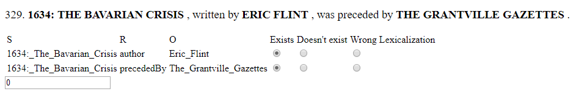
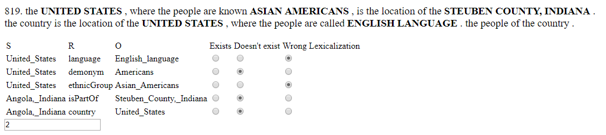

# Manual Semantics Evaluation

As described in the paper, we performed a manual evaluation in which we checked for each relation if it exists in a sentence, if there is a relation but it is lexicalized wrongly, or if it does not exist.

Further, we also report on the amount of relations made up or repeated.

The first number in every sentence is the ID of the sentence, and is to be ignored.

The full report can be found [Here](report.pdf).

## Examples

In this example, we see a sentence, and the judgment for each relation.
Both relations exists in the sentence, are well lexicalized, and no new relations were introduced.


On the other hand, in this example, we see the system did not manage to realize the data into a good sentence.

Breakdown of every relation:
- The relation `United_States | language | English_Language` was expressed as `United_States | demonym | English_Language`.
- The relation `United_States | demonym | Americans` is missing from the text.
- The relation `United_States | ethnicGroup | Asian_Americans` was expressed with the meaning of `United_States | demonym | Asian_Americans`.
- The relation `Angola_Indiana | isPartOf | Steuben_Country_Indiana` is missing from the text.
- The relation `Angola_Indiana | country | United_States` is missing from the text.

Breakdown of added relations:
- From "UNITED STATES ... is the location of the STEUBEN_COUNTY_INDIANA", while true, does not appear in the source data directly. If it was expressed with the linking entity "Angola_Indiana", it would be OK.
- From "The country [The United States] is the location of the UNITED STATES" we infer a weird relation: `United_States | location | United_States`.





## How ro Run:
First, make sure you have some sort of an HTTP server install. If not, run:
```bash
npm i -g http-server
```

To view the current decisions, run the HTTP server on the this folder. If you are using `http-server`, the command is `http-server .`.

You can change whatever decisions you choose, and in the end, go to the top of the page, and press "Download". To have the new decisions updated, replace the file `samples.json` with the new downloaded file.

To create a new file on new sentences, run the given python script called `create.py` on a list of output files you specify in line 16.

Finally, to get an evaluation of each system, run `anal.py` which will get the results from `samples.json`.
 
